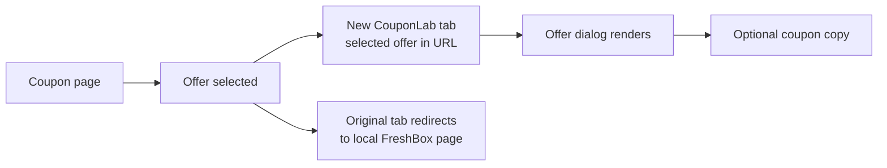

# CouponLab: FreshBox coupon practice

CouponLab is an original, responsive coupon-offer experience built to practise frontend development, Google Tag Manager-style instrumentation, GA4 event design, accessibility, testing, and a reviewable GitHub workflow.

CouponLab, FreshBox, the other store names, all offers, coupon codes, artwork, affiliate parameters, and retailer content are fictional. The app contains no real GTM container, analytics destination, affiliate link, or redeemable offer.

## Quick start

Node.js 20 or newer is recommended.

```bash
npm install
npm run dev
```

Open the local URL printed by Vite. Useful commands:

```bash
npm run format
npm run lint
npm run typecheck
npm test
npm run build
```

## What is included

- Responsive CouponLab header, search, breadcrumbs, merchant summary, disclosure, footer, and cookie controls
- Typed offer data rendered from `src/data/offers.ts`
- All, Codes, Deals, and Verified filters
- Offer cards with expandable terms, verification, expiry, and type details
- Expired offers, senior and student content, saving guide, FAQs, related stores, and sharing
- Local `/retailer` experience for safe end-to-end affiliate-flow practice
- URL-driven offer dialog with clipboard support
- Consent-aware `window.dataLayer` events and a development debugger
- An on-page practice lab that pushes a visible example event
- Keyboard controls, semantic landmarks, visible focus, responsive layouts, and reduced-motion support
- Vitest and Testing Library interaction coverage

The root Vite app is the CouponLab experience. The pre-existing `contact.html` remains available as a separate legacy tracking exercise and was not folded into the React architecture.

## Architecture

```text
src/
├── components/
│   ├── AnalyticsDebugger.tsx
│   ├── CookieConsent.tsx
│   ├── Header.tsx
│   ├── OfferCard.tsx
│   └── OfferModal.tsx
├── data/
│   ├── content.ts
│   └── offers.ts
├── lib/
│   ├── affiliate.ts
│   └── analytics.ts
├── pages/
│   └── RetailerPage.tsx
├── test/
│   ├── app.test.tsx
│   └── setup.ts
├── App.tsx
├── main.tsx
├── styles.css
└── types.ts
```

`App.tsx` selects the coupon page or local retailer page from the pathname. Offer and editorial content live outside the components. `analytics.ts` owns consent checks and the in-browser data layer. `affiliate.ts` constructs only same-origin practice URLs.

## Offer-click tab flow



On “See code” or “See deal,” the app:

1. pushes `offer_select`;
2. calls `window.open()` with `/?offer=<stable_offer_id>`;
3. attempts to return focus to the original tab;
4. pushes `affiliate_redirect`; and
5. sends the original tab to `/retailer?merchant=freshbox&offer_id=...&source=couponlab`.

The opened coupon tab reads the `offer` query parameter and renders the matching dialog. `offer_popup_view` is pushed after the dialog enters the render cycle. A successful clipboard write is required before `coupon_copy` is pushed.

### Browser limitations and fallback

Browsers decide whether a new tab opens in the background, foreground, or a new window. JavaScript cannot guarantee background focus across browser and user settings. `blur()` plus `window.focus()` is the closest standards-based attempt, and the original tab is the one navigated to the retailer.

Popup blockers can cause `window.open()` to return `null`. In that case the retailer URL includes `popup_blocked=1` and displays an “Open offer tab” fallback. This preserves a testable route without using a real affiliate destination. Browsers that return a non-null handle despite suppressing UI may not expose reliable blocker detection.

## Consent model

Consent is a device-local simulation stored under `couponlab_analytics_consent`.

- `consent_update` is essential to the demonstration and is always added to the local data layer.
- All other events are optional and are suppressed unless analytics consent is `granted`.
- Granting consent emits the initial `page_view` and `offer_list_view` that were held while the banner was open.
- Declining consent sends nothing beyond the local consent update.
- No event includes a name, email address, coupon recipient, free-form search result, or other personal information.
- No network request sends the data layer anywhere.

Clear the site’s local storage to reset the simulated choice.

## Analytics debugger

In development, the bottom-right “Analytics debugger” panel shows the eight most recent data-layer entries. It is excluded from a normal production build. Add `?debug=1` to enable it intentionally in production practice environments.

## Event dictionary

| Event                 | When it fires                         | Key parameters                                                                                                                            | Suggested GA4 treatment      |
| --------------------- | ------------------------------------- | ----------------------------------------------------------------------------------------------------------------------------------------- | ---------------------------- |
| `page_view`           | Initial page load after consent       | `page_type`, `merchant`                                                                                                                   | Standard event               |
| `offer_list_view`     | Initial active-offer list view        | `merchant`, `offer_count`, `filter_name`                                                                                                  | Custom event                 |
| `offer_filter`        | A filter is chosen                    | `merchant`, `filter_name`                                                                                                                 | Custom event                 |
| `offer_terms_open`    | Terms are expanded                    | `merchant`, `offer_id`, `offer_type`, `offer_position`                                                                                    | Custom event                 |
| `offer_select`        | CTA is selected, before navigation    | `merchant`, `offer_id`, `offer_type`, `discount_label`, `offer_position`, `is_verified`, `customer_segment`, `expiry_date`, `click_label` | Key event candidate          |
| `offer_popup_open`    | URL-selected dialog opens             | `merchant`, `offer_id`, `offer_type`, `is_verified`                                                                                       | Diagnostic custom event      |
| `offer_popup_view`    | Dialog has rendered                   | `merchant`, `offer_id`, `offer_type`, `is_verified`                                                                                       | Funnel event                 |
| `coupon_copy`         | Clipboard write resolves successfully | `merchant`, `offer_id`, `offer_type`                                                                                                      | Key event candidate          |
| `affiliate_redirect`  | Before original-tab redirect          | offer fields plus `destination`, `popup_blocked`                                                                                          | Key event candidate          |
| `faq_expand`          | A closed FAQ is opened                | `faq_index`, `faq_question`                                                                                                               | Custom event                 |
| `related_store_click` | Related store selected                | `merchant`, `related_store`, `destination`                                                                                                | Custom event                 |
| `social_share_click`  | Share control selected                | `merchant`, `social_channel`, `destination`                                                                                               | Custom event                 |
| `internal_search`     | Non-empty store search submitted      | `search_term`, `destination`                                                                                                              | Site-search event; avoid PII |
| `scroll_depth`        | First crossing of 25/50/75/100%       | `percent_scrolled`, `page_type`                                                                                                           | Custom event                 |
| `consent_update`      | Allow or decline selected             | `analytics_storage`                                                                                                                       | Consent diagnostic           |
| `practice_cta_click`  | Practice-lab button selected           | `cta_name`, `page_type`, `merchant`                                                                                                       | Custom event exercise        |

The fictional retailer button also emits `retailer_cta`; it is outside the required coupon-page dictionary and exists for local funnel experimentation.

### Suggested GA4 custom dimensions

Register event-scoped dimensions for `merchant`, `offer_id`, `offer_type`, `filter_name`, `customer_segment`, `is_verified`, `click_label`, `related_store`, `social_channel`, `page_type`, and `popup_blocked`. Keep `offer_position`, `offer_count`, and `percent_scrolled` as numeric metrics when useful. Avoid registering high-cardinality `destination`, `faq_question`, and `search_term` unless there is a clear reporting need.

Suggested GA4 key events:

- `offer_select` for coupon intent
- `affiliate_redirect` for outbound retail intent
- `coupon_copy` for code engagement

Do not mark both popup events as key events; they are better used to diagnose the tab flow.

## Suggested GTM setup

This repository deliberately includes no GTM snippet or container ID. For a practice container:

1. Create Data Layer Variables for each reusable parameter above, using names such as `DLV - offer_id`.
2. Create one Custom Event Trigger per event, or a regex trigger for a related event family.
3. Create GA4 Event Tags that use `{{Event}}` as the event name and map only relevant variables.
4. Add a consent requirement so optional tags require analytics storage to be granted.
5. Preview locally, verify the event sequence, and confirm no personal data enters the data layer.

Recommended trigger groupings:

- Discovery: `page_view|offer_list_view|offer_filter|scroll_depth`
- Offer funnel: `offer_select|offer_popup_open|offer_popup_view|coupon_copy|affiliate_redirect`
- Content: `offer_terms_open|faq_expand|related_store_click|social_share_click|internal_search`
- Consent: `consent_update`

In a real implementation, use GTM Consent Mode APIs and an approved consent-management platform rather than treating local storage as a compliance solution.

## Tests

The test suite covers:

- offer filtering;
- terms expansion;
- FAQ expansion;
- URL-driven dialog rendering;
- successful coupon copy;
- stable data-layer event structure;
- consent suppression;
- local popup and affiliate URL construction; and
- the popup-blocked retailer fallback.

Automated tests mock the clipboard and `<dialog>` APIs where jsdom does not implement browser behaviour. True background-tab focus remains a manual browser behaviour because it is controlled by each browser.

## GitHub workflow

Suggested branch: `feat/coupon-offer-page`

Suggested issue breakdown:

1. Project setup and design system
2. Coupon-page layout
3. Offer filtering and accordions
4. Offer popup and affiliate redirect flow
5. GTM data-layer instrumentation
6. Consent management
7. Tests and accessibility
8. Documentation and deployment

Recommended conventional commits:

```text
chore: initialize coupon practice project
feat: build responsive coupon experience
feat: implement offer popup and affiliate flow
feat: add consent-aware analytics instrumentation
test: cover coupon interactions and tracking
docs: add analytics and workflow guide
```

Before each commit, inspect `git status` and `git diff --staged`, stage only files in that scope, and run the checks relevant to that change. No remote push, pull request, or merge is part of the implementation workflow.

## Deployment

Run `npm run build`; Vite writes the production bundle to `dist/`.

For GitHub Pages, configure the repository’s Pages source to use a GitHub Actions workflow that installs dependencies, runs checks, builds, and uploads `dist`. Because the app uses the clean `/retailer` path, the host must rewrite unknown paths to `index.html`. If the host cannot provide history fallback, change the retailer URL to a query-based route before deployment.

No `.openai/hosting.json` is present, so this project is not connected to OpenAI Sites and no deployment was performed.
